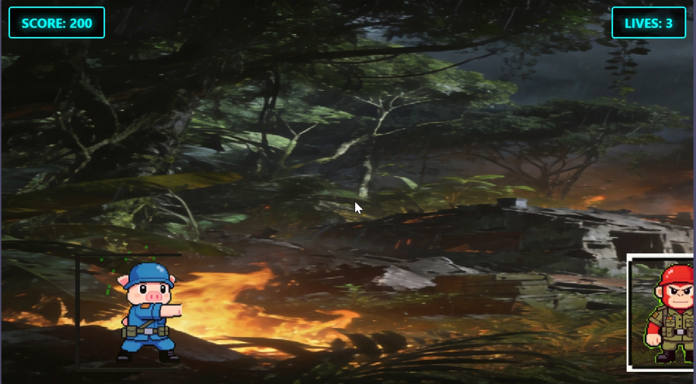

# img_game

使用 AI 生成图片资源的高质量网页游戏开发技能及游戏案例。

## 目录结构

```
img_game/
├── img-game-dev/       # 游戏开发技能（基于 TRAE IDE）
│   └── templates/      # 游戏模板
└── pig-contra-game/    # 完整游戏案例（使用技能开发）
```

## img-game-dev - 游戏开发技能

使用 AI 生成图片资源的高质量网页游戏开发技能。

### 核心特点

- **AI 生成资源**：使用 Seedream 生成角色精灵图、豆包 API 生成背景和材质图
- **通用精灵管理**：集成 sprite-management 技能，支持精灵图动画、资源加载、粒子效果
- **高质量游戏**：专业级美术资源，流畅的动画效果，商业级游戏品质
- **完整工作流**：从概念到可运行游戏，模块化代码架构

### 技能使用

```
Use Skill: img-game-dev
```

## pig-contra-game - 游戏案例

使用 `img-game-dev` 技能开发的完整横版动作游戏。

### 游戏截图



### 游戏说明

- **游戏类型**：横版平台动作游戏
- **操作方式**：
  - 方向键/AD：移动
  - 空格：跳跃
  - J：攻击
- **游戏目标**：击败遇到的敌人

### 运行方式

直接用浏览器打开 `pig-contra-game/index.html` 即可运行。

## 相关技能

- [game-character-design](https://github.com/jadragfly/game-character-design) - 角色精灵图生成
- [sprite-management](https://github.com/jadragfly/sprite-management) - 通用精灵管理
- [doubao-api](https://github.com/jadragfly/doubao-api) - 豆包 API 调用

## License

MIT
